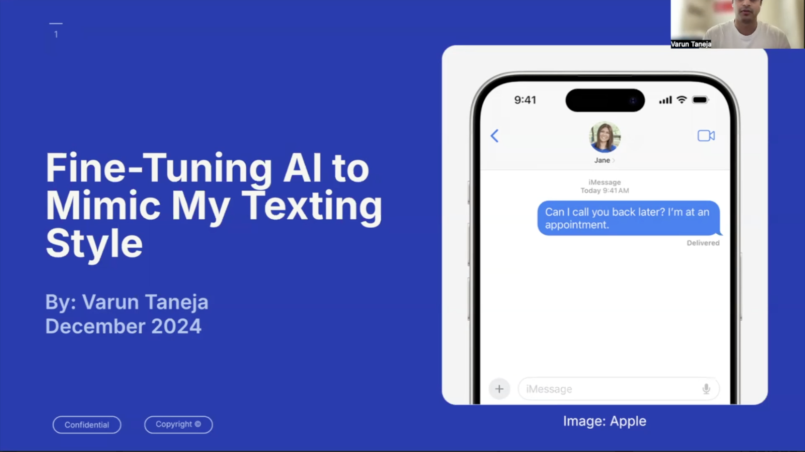

# Chat Data Fine-Tuning Project

## Overview

This project was developed as part of a class at the University of Notre Dame. The primary goal was to explore the effectiveness of **personal supervised fine-tuning** using OpenAI’s models. Specifically, the project investigates how easily someone with basic programming skills can fine-tune a large language model to act as their conversational proxy—or, in other words, as a personalized “deepfake” chatbot.

## Motivation

With the rise of accessible AI tools, it’s now possible for individuals to create models that mimic their own conversational style using their personal chat data. This project demonstrates:
- How to preprocess and unify chat data from multiple sources (iMessage, Facebook Messenger, WhatsApp) into a single, easy-to-use format.
- How to use OpenAI’s Supervised Fine-Tuning (SFT) workflow to train a model on this data.
- The feasibility and implications of creating a chatbot that can convincingly imitate a specific person’s texting style.

## Features

- **Unified Data Format:** All chat data is converted into the WhatsApp format, making it easy to process and merge.
- **Data Conversion:** Scripts to convert raw chat exports (iMessage, Facebook Messenger, WhatsApp) into the unified format.
- **Data Merging:** Combine multiple chat sources into a single dataset.
- **Pipeline Automation:** A pipeline script to automate the end-to-end process.
- **Supervised Fine-Tuning:** Utilizes OpenAI’s SFT workflow to fine-tune a model on your processed chat data.

## Directory Structure

```
FinalProject/
├── convert_data.py
├── convert_fb_chats.py
├── convert_imessage.py
├── merge_data.py
├── pipeline.py
├── to_jsonl.py
└── ...
```

## How It Works

1. **Convert Chat Data:**  
   Use `convert_imessage.py`, `convert_fb_chats.py`, and your WhatsApp export to convert all chat data into the WhatsApp format.

2. **Merge Data:**  
   `merge_data.py` combines all WhatsApp-formatted chat sources into a single dataset.

3. **Convert to JSONL:**  
   `to_jsonl.py` transforms the merged data into JSONL format, ready for fine-tuning.

4. **Pipeline Automation:**  
   `pipeline.py` automates the above steps for streamlined processing.

5. **Supervised Fine-Tuning with OpenAI:**  
   I followed the steps outlined in the [OpenAI Supervised Fine-Tuning documentation](https://platform.openai.com/docs/guides/supervised-fine-tuning) to fine-tune the model on my processed chat data.

## Why WhatsApp Format?

WhatsApp’s export format is simple, consistent, and easy to parse. By converting all chat data into this format, the project ensures:
- **Consistency:** All sources are handled the same way.
- **Simplicity:** Downstream scripts only need to handle one format.
- **Extensibility:** New chat sources can be added by writing a converter to WhatsApp format.

## Requirements

- Python 3.8+
- OpenAI Python SDK (`pip install openai`)
- Other dependencies as specified in your scripts

## How to Export Your Chat Data

### WhatsApp
1. Open the WhatsApp app on your phone.
2. Go to the chat you want to export.
3. Tap the contact's name or group subject at the top.
4. Scroll down and select **Export Chat**.
5. Choose whether to include media or not.
6. Select your preferred method to save or send the exported chat file (e.g., email, Google Drive).
7. Download the exported `.txt` file to your computer.

### Facebook Messenger
1. Go to [Facebook Settings & Privacy > Settings](https://www.facebook.com/settings) on a desktop browser.
2. In the left sidebar, click **Your Facebook Information**.
3. Click **Download your information**.
4. Deselect all, then select only **Messages**.
5. Choose the date range, format (recommend JSON), and media quality.
6. Click **Create File**.
7. Once the file is ready, download it from the **Available Files** tab.

### iMessage (Mac)
To export your iMessage data, use the open-source tool [imessage-exporter](https://github.com/ReagentX/imessage-exporter):

1. Visit the [imessage-exporter GitHub page](https://github.com/ReagentX/imessage-exporter).
2. Follow the installation instructions for your operating system.
3. Use the tool to export your iMessage data to `.txt` or `.html` format.
4. Transfer the exported file(s) to your project directory for processing.

---

## Usage

1. Place your raw chat exports (iMessage, Facebook Messenger, WhatsApp) in a local directory.
   
2. Run the conversion and merging scripts:
   ```bash
   python convert_imessage.py
   python convert_fb_chats.py
   python merge_data.py
   python to_jsonl.py
   ```
   Or use the pipeline:
   ```bash
   python pipeline.py
   ```
3. Fine-tune your model by following the steps in the [OpenAI Supervised Fine-Tuning documentation](https://platform.openai.com/docs/guides/supervised-fine-tuning).

## Project Video

[](https://drive.google.com/file/d/1qHmEp9I-UBjjQnImlX6AdQ5308PJSz4T/view?usp=sharing)

*Click the image above to watch a video overview of the project on Google Drive!*


---

## License

MIT License